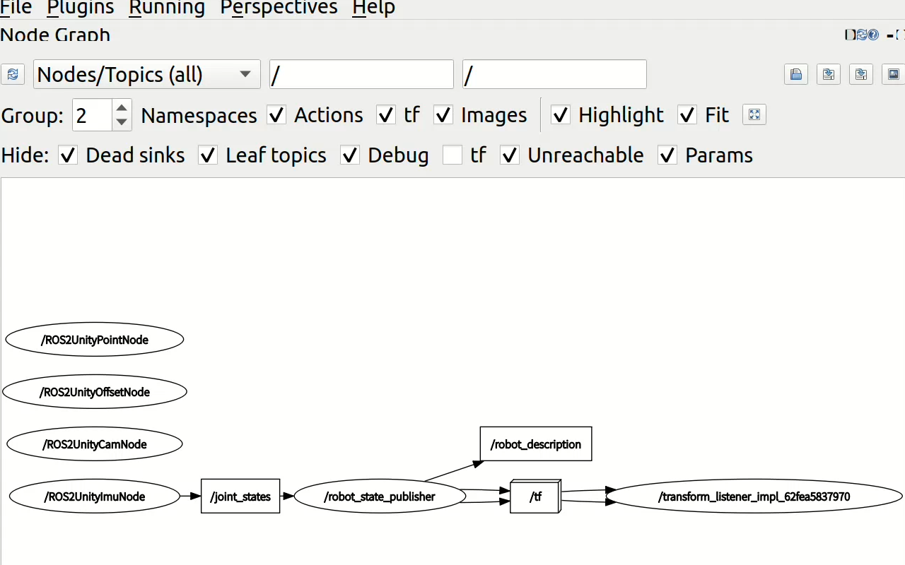

# 第二轮考核
> by dixiatielu
## ROS&TF2
### 1. rqt和命令行工具
urdf包编译运行后，查看到机器人模型如下：

启动RM Simulator以及urdf包和rqt后，查看到的节点/话题图如下：


通过命令行查看话题内容
`/robot_description`话题内容如下：


包含信息：机器人URDF模型描述内容。

`joint_states`话题内容如下（实时更新）：


包含信息：时间戳、各关节的旋转位置、速度（为空）。

`tf_static`话题内容如下（截取单个示例）：
```
transforms:
- header:
    stamp:
      sec: 1725437530
      nanosec: 472135480
    frame_id: pitch_link
  child_frame_id: camera_link
  transform:
    translation:
      x: 0.0718000000091155
      y: 0.0
      z: 0.0714999999908555
    rotation:
      x: -0.500000000031865
      y: 0.5000000000318667
      z: -0.49999999996813504
      w: 0.49999999996813327
```
这个节点发布的信息包括了：
1. 坐标系的变换关系：
  每个transform块定义了两个坐标系（frame_id和child_frame_id）之间的静态变换关系，包括平移（translation）和旋转（rotation）。
2. 时间戳：
  header.stamp部分记录了发布该变换的时间点。

`tf`话题和`tf_static`话题发布的信息类似，但随着机器人的运动实时更新。

`image_raw`话题内容(截取片段)如下：

```
header:
  stamp:
    sec: 1725498893
    nanosec: 939642368
  frame_id: camera_link
height: 512
width: 640
encoding: rgb8
is_bigendian: 0
step: 1920
data:
- 9
- 9
- 11
- 8
- 8
- 10
- 8
- 8
- 10
- 9
- 9
- 11
- 8
- 8
- 10
- 8
- 8
- 10
- 8
- 8
- 10
- 7
- 8
- 9
- 10
- 10
- 12
- 8
- 9
- 10
- 9
- 9
- 11
- 9
- 9
- 11
- 9
- 9
- 11
- 9
- 9
- 11
- 8
- 8
- 10
- 9
- 9
- 11
- 9
- 9
- 11
- 10
- 10
- 12
- 8
- 8
- 10
- 9
- 9
- 11
- 9
- 9
- 11
- 9
- 9
- 11
- 9
- 9
- 11
- 9
- 9
- 11
- 9
- 9
- 11
- 9
- 9
- 11
- 8
- 8
- 10
- 9
- 9
- 11
- 10
- 10
- 12
- 9
- 9
- 11
- 9
- 9
- 11
- 9
- 9
- 11
- 9
- 9
- 11
- 10
- 10
- 12
- 8
- 8
- 10
- 9
- 9
- 11
- 9
- 9
- 11
- 9
- 9
- 11
- 10
- 10
- 12
- 9
- 9
- 11
- 9
- 9
- 11
- 9
- 9
- 11
- 9
- 9
- '...'
---
```

包含信息：图像的高度、宽度、编码方式、数据等。

`target_point`话题实时发布敌人坐标，内容如下。
```
header:
  stamp:
    sec: 1725503941
    nanosec: 934796288
  frame_id: ''
point:
  x: 0.5430076122283936
  y: -0.10000001639127731
  z: -0.20007848739624023
---
```
包括了时间戳、敌人当前位置的xyz坐标。

---

时间原因，仅完成了ROS部分。题目2-5的代码以及演示视频已放在仓库中和`ros2_ws`目录下。